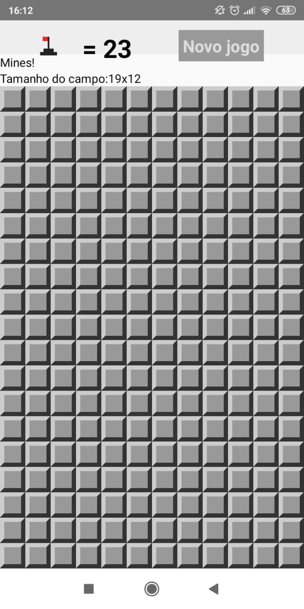
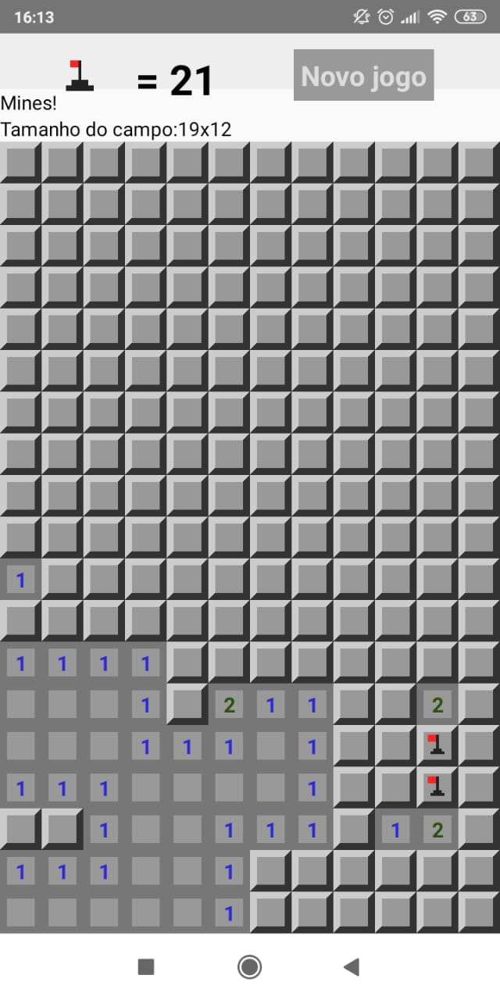
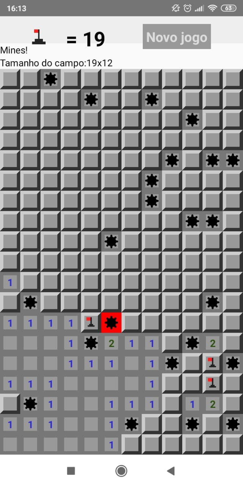
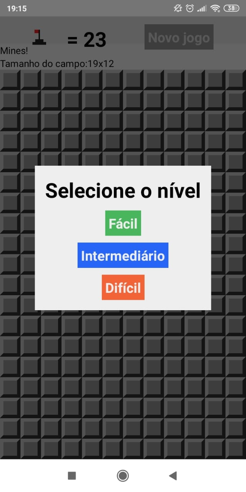

# mines
TODO: Update README.md

## Check if your device is connecting correctly to ADB, Android Debug Bridge
``adb devices``
Seeing **device** in the right column means the device is connected

## To run the application without an emulator (run via USB)
### Android
``react-native run-android``

### iOS
``react-native run-ios``

## To view the application logs
### Android
``react-native log-android``

### iOS
``react-native log-ios``

### Game execution:

 

 

#### It allows the marking of flags where there may be a mine:

 

#### Allows level selection:

